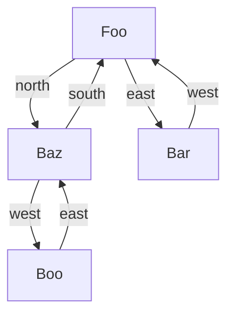

## Overview

[](https://codecov.io/gh/zivkovicmilos/alien-invasion)
[](https://github.com/zivkovicmilos/alien-invasion/actions/workflows/main.yml)

`alien-invasion` is a simple game that simulates an alien invasion on Earth. The rules of the game are relatively
simple. The user provides an input map containing the cities on Earth, and specifies the number of aliens for the
simulation.
Once the aliens are unleashed, they randomly move between cities and, if two aliens encounter each other, they destroy
the city and die.

## Usage

The simulator has a relatively small footprint, and offers useful options.

```
$ alien-invasion --help
A program for simulating the invasion of mad aliens on Earth

Usage:
   [flags]

Flags:
  -h, --help                 help for this command
      --log-level string     The log level for the program execution (default "INFO")
      --map-path string      The path to the input map file of the Earth
      --output-path string   The path to output the Earth map after the invasion. If omitted, the output is directed to the console
```

Running a simulation with `3` aliens using the map example below in [the input section](#input):

```
$ alien-invasion 3 --map-path ./mapfile.txt                    
2022-10-29T21:58:14.705+0200 [INFO]  alien-invasion.earth-map: Map initialized with 5 cities
2022-10-29T21:58:14.706+0200 [INFO]  alien-invasion.earth-map.Baz: City has been destroyed by aliens 1 and 2!
2022-10-29T21:58:14.794+0200 [INFO]  alien-invasion.earth-map: The final alien has finished
2022-10-29T21:58:14.794+0200 [INFO]  alien-invasion.earth-map: A total of 1 cities were destroyed
Bee east=Bar                                                                                     
Foo north=Bar south=Qu-ux                                                                        
Bar south=Foo west=Bee                                                                           
Qu-ux north=Foo                                                                                  
2022-10-29T21:58:14.794+0200 [INFO]  alien-invasion: Invasion completed successfully!
```

### Input

The user provides the map using the `--map-path` flag, and specifying the path to the file containing the cities.
The map is in a file, with one city per line. The city name is first, followed by 1-4 directions (north, south, east or
west). Each one represents a road to another city that lies in that direction.

For example:

```
Foo north=Bar west=Baz south=Qu-ux
Bar south=Foo west=Bee
```

The city and each of the pairs are separated by a single space, and the directions are separated from their respective
cities with an equals (=) sign.

### Output

The user can specify an output path for the map after the simulation executes, by using the `--output-path` flag.
If no output file path is provided, the remaining cities on the map are printed to the standard output.

## Architecture

### Cities

Cities are represented in the form of an undirected graph, with the additional attribute that links contain directions (
north, south, east and west).

If City A has a path to City B, then City B also has a path to City A in the opposite direction.



In this example image, `Foo` has a north path to `Baz`, and an east one to `Bar`. Consequently, `Baz` has a south path
to `Foo`, and `Bar` has a west path to `Foo`.

A city can contain **at most 2** invaders at the same time. If a city contains 2 invaders(or if it is destroyed), it is
no longer accessible to other aliens in the simulation. This means that an alien cannot travel to a city that is
destroyed (or has 2 invaders).

### Simulation

The simulation of an alien invasion is straightforward, and consists of a few steps:

1. Randomly assign starting cities for each alien
2. Let loose the alien on the city, and to roam
3. Wait until the simulation terminates (either)
    * all aliens are dead
    * all aliens moved at least 10k times
    * the user terminated the program with an exit signal (CTRL-C)
4. Remove destroyed cities

### Aliens

Aliens are represented as go-routines that start out at a given city, and roam around using the neighbor links.

There are several ways an alien can die:

* it moves `10000` times
* it encounters another alien in the same city and fights
* it runs out of moves to make (stuck in a city with no valid neighbors)
